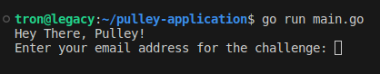
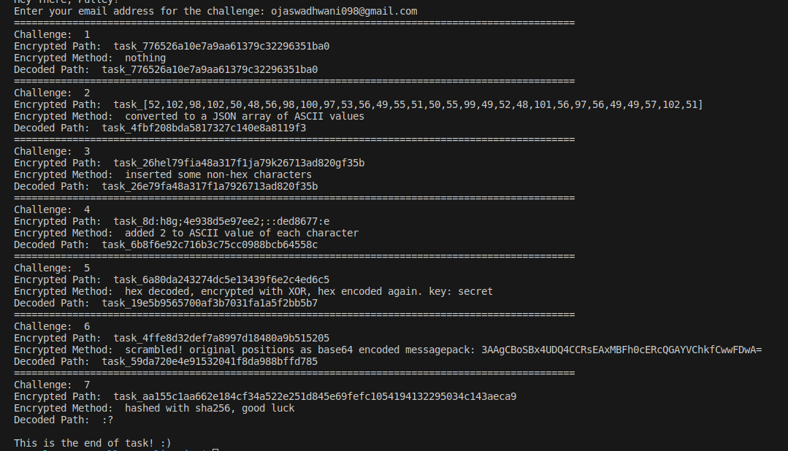

# pulley-challenge
Challenge for Pulley: https://www.workatastartup.com/jobs/65612

# Description

### Interview Problem Solutions by Ojas Wadhwani

## Introduction
Hello! I'm [Ojas Wadhwani](https://github.com/OjasWadhwani), and I tackled the [interview problem](https://ciphersprint.pulley.com/) for Pulley for the above job role. Below are the solutions to the seven challenges presented.

## Email Input
To start the challenge, I entered my email address:

Once this is done, the script written in [main.go](https://github.com/OjasWadhwani/pulley-application/blob/main/main.go) solves the consecutive challenges by extracting the request path and making a `GET` request to get the next:

## Challenge Solutions
The solutions are implemented in Go. Each challenge had some basic steps of extracting the `encryption_method` and `encryption_path`, removing the `task_` prefix and executing the custom logic to decrypt the string. 

Some of the challenges required to extract information from `encryption_method`. Here's a breakdown of the challenges along with their encryption methods and explanations:

| Challenge No. | Encryption Method                                 | Explanation                                                           | Commit                                                                                                         |
|---------------|---------------------------------------------------|-----------------------------------------------------------------------|----------------------------------------------------------------------------------------------------------------|
| 1             | nothing                                           | -                                                                     | -                                                                                                              |
| 2             | converted to a JSON array of ASCII values        | Converted ASCII values to characters                                  | [commit](https://github.com/OjasWadhwani/pulley-application/pull/1/commits/a4cae1fd2fbe8005635f356d88635f85d32387e2) |
| 3             | inserted some non-hex characters                | Added a regex to remove all non-hex characters                        | [commit](https://github.com/OjasWadhwani/pulley-application/pull/1/commits/d7a97d91ed62c293eb1b3515c4940019c7dce550) |
| 4             | added x to ASCII value of each character        | Extracted the value of x from the encryption method and added it to the encrypted path | [commit](https://github.com/OjasWadhwani/pulley-application/pull/1/commits/32a8fc057c8a90a5d793acbf5d3654b15afc55c6) |
| 5             | hex decoded, encrypted with XOR, hex encoded again. key: secret | Decoded the path using the `hex` package, decrypted using XOR with the key as `secret`, and encoded using hex again | [commit](https://github.com/OjasWadhwani/pulley-application/pull/1/commits/562ca1a37b2e954392f69812aca6b002098ba33e) |
| 6             | scrambled! original positions as base64 encoded messagepack | To unscramble the path, decoded the message pack in `base64` to get the original positions. Learned about a new Go package while implementing this - [msgpack](https://pkg.go.dev/github.com/vmihailenco/msgpack) | [commit](https://github.com/OjasWadhwani/pulley-application/pull/1/commits/8065a1e481aef308bf3d6032468811c5b64c5222) |
| 7             | hashed with sha256                               | Gimmick! SHA256 encryptions are one way hashes                       | -                                                                                                              |

